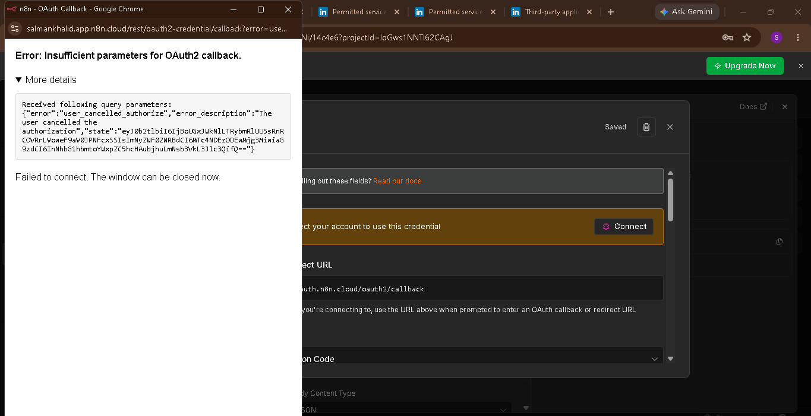
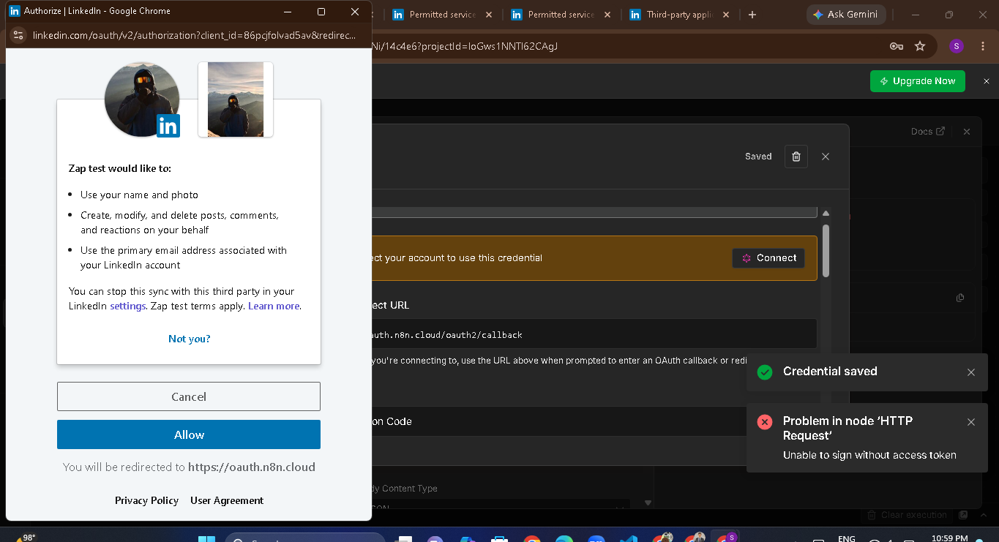
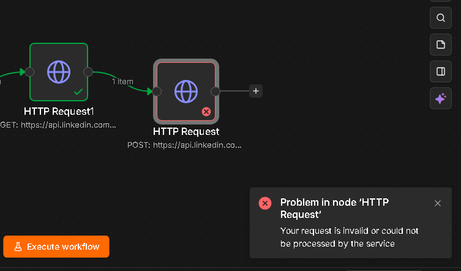
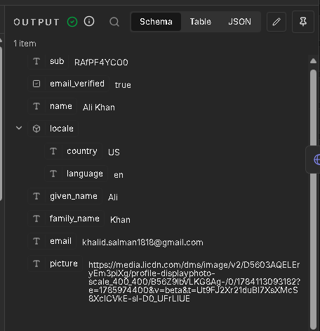
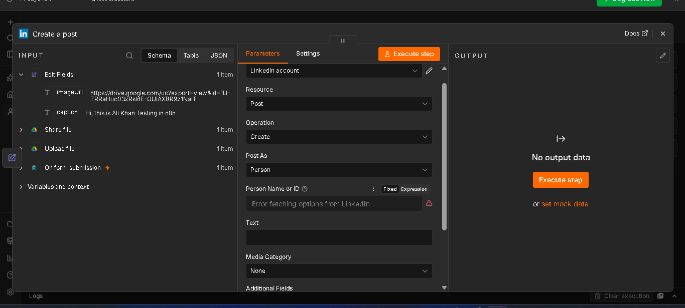

# LinkedIn Posting via API/n8n Fails for New Self-Serve Developer Apps

## Summary

Any newly created LinkedIn Developer app (post-2023, OpenID Connect-based) **cannot programmatically post to LinkedIn** via the standard `/v2/ugcPosts`, `/rest/posts`, or n8n's native LinkedIn node — regardless of correct OAuth setup, correct scopes, or correct headers. This is a platform-level restriction, not a configuration error, and is already documented across multiple open n8n GitHub issues.

## Environment

- n8n (Cloud), latest version as of July 2026
- LinkedIn Developer App with products: **Sign In with LinkedIn using OpenID Connect**, **Share on LinkedIn**
- Credential type tested: Generic OAuth2 API, native LinkedIn OAuth2 API, native LinkedIn node

## What Was Tried (in order)

### 1. Raw HTTP Request to `/rest/posts`
- Required headers: `LinkedIn-Version` (YYYYMM), `X-Restli-Protocol-Version: 2.0.0`
- **Result:** `403 Forbidden` — this endpoint requires LinkedIn's **Community Management API** product, which requires a full manual business-verification review (days–weeks), not available via self-serve.

### 2. Raw HTTP Request to `/v2/ugcPosts` (legacy endpoint)

First, the OAuth connection itself needed a couple of retries — an initial cancelled authorization attempt:

Once the LinkedIn consent screen was reached and approved correctly (note the granted permission "Create, modify, and delete posts, comments, and reactions" — confirming `w_member_social` was active):

The workflow was set up with a `/userinfo` lookup node feeding into the posting node:

- Required `author` field format: `urn:li:person:{numeric_id}` or `urn:li:member:{numeric_id}` — digits only (validated via regex on LinkedIn's side).
- Attempted to source this ID via `GET /v2/userinfo` → returns a `sub` field, but this is an **OpenID Connect "pairwise" identifier** (per LinkedIn's own docs), which is intentionally non-convertible to the legacy numeric member ID:

- Attempted to source the ID via `GET /v2/me` (legacy endpoint) → `403 Forbidden`, `Not enough permissions to access: me.GET.NO_VERSION` — requires `r_liteprofile` scope, which is **no longer grantable to new self-serve apps**.
- **Result:** Dead end — no self-serve path exists to obtain a numeric ID compatible with this endpoint.

### 3. n8n's native "LinkedIn" node (`Post As: Person`)
- **Result:** `Person Name or ID` dropdown fails with `Error fetching options from LinkedIn`. Confirmed as a known, currently open, unresolved bug — the node calls the same restricted profile-lookup internally.

## Root Cause

LinkedIn migrated new self-serve developer apps to **OpenID Connect–only** identity access. This access tier:
- Does **not** include `r_liteprofile` (needed for the legacy numeric ID).
- Returns only a **pairwise `sub`** identifier via OpenID, which cannot be used in `/v2/ugcPosts`'s `author` field.
- Leaves `/rest/posts` (the modern replacement) gated behind the **Community Management API**, a vetted-partner-only product.

**There is currently no self-serve path for a new individual/developer LinkedIn app to post via API.** Vetted platforms (e.g., Zapier, Buffer, Hootsuite) retain older, grandfathered access levels that bypass this restriction — this is why third-party scheduling tools still work while raw API/n8n integrations do not.

## Related Public Issues

- https://github.com/n8n-io/n8n/issues/16802
- https://github.com/n8n-io/n8n/issues/28223
- https://github.com/n8n-io/n8n/issues/20413
- https://community.n8n.io/t/linkedin-node-error-fetching-person-name-or-id/177969
- https://community.n8n.io/t/issue-in-linkedin-connect/156142
- https://community.n8n.io/t/403-forbidden-error-with-linkedin-node-all-troubleshooting-failed/156991

## Workaround Used

Posting to LinkedIn was completed via **Zapier's native LinkedIn integration** instead, which holds grandfathered/vetted API access and does not hit this wall. Tradeoff: Zapier's LinkedIn action renders posts as a link-card (with image thumbnail) rather than a native inline photo post, since it also predates the newer restrictions but uses an older content-sharing method.

## Recommendation for Others Hitting This

If you're building a **new** LinkedIn integration in 2026 for personal/individual use:
1. Don't attempt raw API or n8n's native LinkedIn node for posting — you will hit this wall regardless of configuration.
2. Use a vetted third-party tool (Zapier, Make, Buffer) that already has grandfathered API access.
3. If native/custom posting is a hard requirement, you must apply for LinkedIn's Community Management API and go through full business verification — budget days to weeks for approval.
